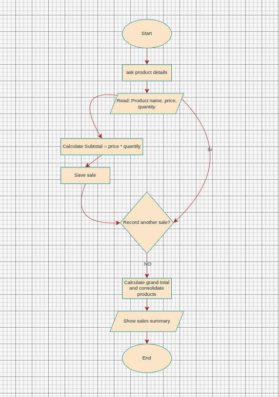

# Sales System Python by: Joseph Romero

A modular Python system designed to automate the daily sales registration 
process of a local store.

## Project Flowchart



## Description

This system is a Python-based terminal application that allows store 
administrators to register multiple sales, group repeated products 
automatically, and generate a detailed summary with the total revenue 
of the day. The project is organized into five independent modules, 
each one with a single responsibility.

## Getting Started

### Dependencies

* Python 3.8 or higher
* No external libraries required — only Python standard modules
* Compatible with Windows, Linux and macOS
* Terminal or command prompt to run the program

### Installing

* Clone the repository from GitHub:
```bash
git clone https://github.com/your-username/Sales_System_Project.git
```
* Navigate to the project folder:
```bash
cd Sales_System_Project
```
* No additional installations are needed — the project runs with Python only.

### Executing program

* Run the program from the terminal:
```bash
python main.py
```
* Follow the on-screen instructions:
  1. Enter the product name when prompted.
  2. Enter the unit price.
  3. Enter the quantity sold.
  4. Type `yes` to register another sale or `no` to finish.
* The system will display the complete sales summary at the end.

## How it works

1. `main.py` starts the program and calls `register_sales()`.
2. `Fun_inputs.py` captures and validates every user input.
3. `Fun_validations.py` checks that text contains only letters and numbers are greater than zero.
4. `Fun_registration.py` stores each sale in a dictionary and groups repeated products.
5. `Fun_calculations.py` multiplies price by quantity and returns the total.
6. `Fun_display.py` prints the final summary with the grand total of the day.

## Project Structure
```text
Sales_System_Project/
├── Fun_validations.py   # Security filters for text and numbers
├── Fun_calculations.py  # Mathematical logic for totals
├── Fun_inputs.py        # Captures raw user input
├── Fun_registration.py  # Manages the sales loop and accumulation
├── Fun_display.py       # Formats and displays results
├── main.py              # Application entry point
└── README.md            # Project documentation
```

## Status

> This project is currently working as a fully functional terminal-based 
> application. The system is actively being maintained and new features 
> are being planned for future versions.

## Author

Joseph Romero


